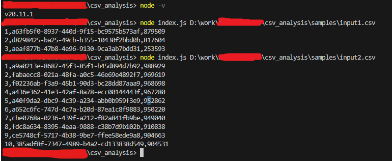

# CSV分析CLIツール

- 開発環境: node.js 20.11.1

# CLIの説明

- ゲームプレイログを含むcsvファイルをロードし、平均点の高い順にランキング上位10位を抽出し、結果を標準出力に出力する CLI プログラムを出力します。

- csvファイルの列は以下の通りです。

・ログ時間（Unixtimeミリ秒）
・ユーザーID文字列
・スコア

（例）
1709280121438,a63fb5f0-8937-440d-9f15-bc9575b573af,914130
...

- 次の形式でユーザーごとに 1 行を出力します。

ランキング、ユーザーID、平均スコア

（例）
1、a63fb5f0-8937-440d-9f15-bc9575b573af、457115


- ランキング上位10位以内にユーザーがいない場合は、出力可能なランキングを出力します。
- 平均点が同じ場合は順位も同じとなります。
- 0 < スコア <= 1000000
- 1 < CSV ログ行数 <= 1000000

## ❯ はじめる

### ステップ 1: 開発環境をセットアップする

何かを始める前に、開発環境をセットアップする必要があります。

インストール [Node.js and NPM](https://nodejs.org/en/download/)

次に、アプリケーション環境をセットアップします。

```bash
npm install(or npm install --force)
```

### ステップ2: cli ツールを実行する

```bash
node index.js input.csv
```

- input.csv は実際のCSVファイルのパスに置き換えてください。

> こちらがcliテストの結果です。


